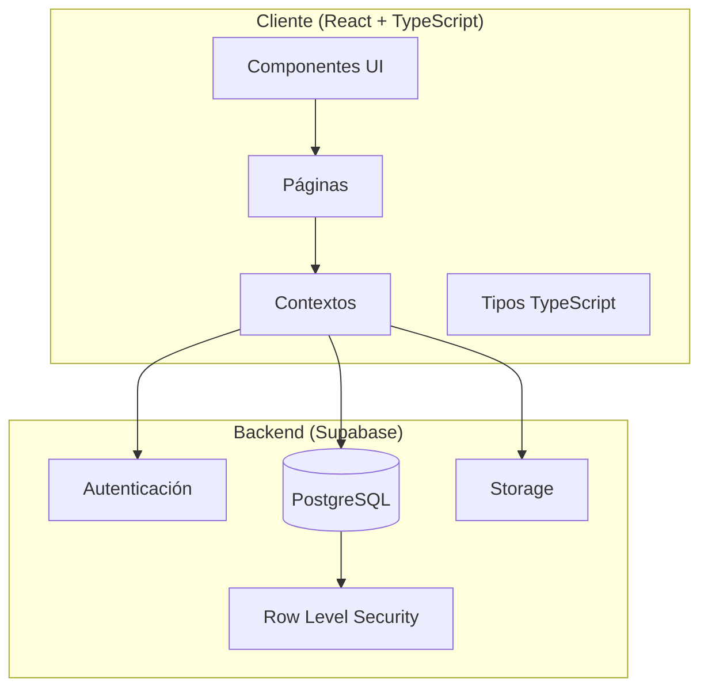

<p align="center">
  
</p>

<h1 align="center">🛒 Multiprecios Diego</h1>

<p align="center">
  <strong>Sistema de Gestión de E-Commerce</strong><br/>
  Plataforma completa para tienda online con panel administrativo
</p>

<p align="center">
  
  
  
  
  
</p>

<p align="center">
  
  
  
</p>

---

## Índice

- [Descripción](#-descripción)
- [Características](#-características)
- [Arquitectura](#-arquitectura)
- [Tecnologías](#-tecnologías)
- [Instalación](#-instalación)
- [Estructura del Proyecto](#-estructura-del-proyecto)
- [Base de Datos](#-base-de-datos)
- [Roles y Permisos](#-roles-y-permisos)
- [Internacionalización](#-internacionalización)
- [Despliegue](#-despliegue)
- [Documentación Relacionada](#-documentación-relacionada)
- [Contribución](#-contribución)
- [Licencia](#-licencia)

---

## Descripción

**Multiprecios Diego** es un sistema de comercio electrónico desarrollado como prototipo funcional para una tienda de productos variados. El proyecto implementa una arquitectura moderna cliente-servidor usando React para el frontend y Supabase como Backend-as-a-Service (BaaS).

### Contexto del Proyecto

Este prototipo ha sido desarrollado como parte de un proyecto académico/profesional, incluyendo:
- **ERS (Especificación de Requisitos del Software)**: Documento que define los requisitos funcionales y no funcionales
- **DAS (Documento de Arquitectura del Software)**: Especificación de la arquitectura y decisiones de diseño

---

## Características

### Para Clientes

| Característica | Descripción |
|---------------|-------------|
| **Catálogo de Productos** | Navegación intuitiva con búsqueda y filtros por categorías |
| **Carrito de Compras** | Gestión de productos con cantidades y cálculo automático |
| **Gestión de Pedidos** | Seguimiento en tiempo real del estado de pedidos |
| **Sistema de Reservas** | Reserva de productos con códigos únicos de recogida |
| **Lista de Deseos** | Guardar productos favoritos para compra posterior |
| **Valoraciones** | Sistema de reseñas con puntuación de 1-5 estrellas |
| **Incidencias** | Sistema de tickets para reportar problemas |
| **Perfil de Usuario** | Gestión de datos personales y foto de perfil |
| **Métodos de Pago** | Tarjeta, efectivo, Bizum, PayPal, transferencia |
| **Opciones de Entrega** | A domicilio o recogida en tienda |

### Para Administradores

| Característica | Descripción |
|---------------|-------------|
| **Panel de Control** | Dashboard con estadísticas en tiempo real |
| **Gestión de Usuarios** | Administración de roles (Cliente, Encargado, Admin) |
| **Gestión de Productos** | CRUD completo con imágenes, stock y precios |
| **Gestión de Pedidos** | Actualización de estados y seguimiento |
| **Gestión de Incidencias** | Resolución y seguimiento de problemas |
| **Gestión de Reservas** | Control de reservas de clientes |
| **Categorías** | Organización de productos por categorías |

---

## Arquitectura

El proyecto sigue una arquitectura **cliente-servidor** con separación clara de responsabilidades:



### Patrones de Diseño Implementados

- **Context API Pattern**: Gestión de estado global (Auth, Cart, Wishlist)
- **Protected Routes**: Control de acceso basado en roles
- **Component Composition**: Componentes reutilizables con Radix UI
- **Type Safety**: Tipado estricto con TypeScript

---

## Tecnologías

### Frontend

| Tecnología | Versión | Propósito |
|-----------|---------|-----------|
| React | 18.2.0 | Framework de UI |
| TypeScript | 5.0 | Tipado estático |
| Vite | 6.0 | Build tool y dev server |
| React Router | 6.8.1 | Enrutamiento SPA |
| Tailwind CSS | 3.4.16 | Framework de estilos |
| Radix UI | Latest | Componentes accesibles |
| Lucide React | 0.453.0 | Iconografía |
| i18next | 25.7.1 | Internacionalización |
| React Helmet Async | 2.0.5 | SEO y meta tags |

### Backend (Supabase)

| Servicio | Propósito |
|----------|-----------|
| PostgreSQL | Base de datos relacional |
| Auth | Autenticación y gestión de sesiones |
| Storage | Almacenamiento de archivos (avatares) |
| RLS | Políticas de seguridad a nivel de fila |

---

## Instalación

### Requisitos Previos

- **Node.js** 18.x o superior
- **npm** o **yarn**
- **Cuenta de Supabase** (gratuita disponible)
- **Git**

### Pasos de Instalación

1. **Clonar el repositorio**
   ```bash
   git clone https://github.com/jfpaardoo/multipreciosDiego.git
   cd multipreciosDiego
   ```

2. **Instalar dependencias**
   ```bash
   npm install
   ```

3. **Configurar variables de entorno**
   
   Crear archivo `.env` en la raíz del proyecto:
   ```env
   VITE_SUPABASE_URL=tu_supabase_url
   VITE_SUPABASE_ANON_KEY=tu_supabase_anon_key
   ```

4. **Configurar la base de datos**
   
   Ejecutar en el SQL Editor de Supabase:
   ```sql
   -- 1. Ejecutar schema principal
   -- Copiar contenido de database/supabase_schema.sql
   
   -- 2. Configurar storage para avatares
   -- Copiar contenido de database/supabase_storage_avatars.sql
   ```

5. **Iniciar servidor de desarrollo**
   ```bash
   npm run dev
   ```

6. **Acceder a la aplicación**
   
   Abrir [http://localhost:5173](http://localhost:5173) en el navegador

---

## Estructura del Proyecto

```
multipreciosDiego/
├── 📁 database/                  # Scripts de base de datos
│   ├── supabase_schema.sql       # Schema principal
│   ├── supabase_storage_avatars.sql # Configuración de storage
│   └── update_product_images.sql # Script de actualización de imágenes
│
├── 📁 docs/                      # Documentación del proyecto
│   ├── ERS.pdf                   # Especificación de Requisitos
│   ├── DAS.pdf                   # Documento de Arquitectura
│   └── 📁 diagramas/             # Diagramas del proyecto
│       └── DiagramaColores4.png  # Diagrama E-R
│
├── 📁 public/                    # Archivos estáticos
│   ├── 📁 products/              # Imágenes de productos
│   ├── logo.png                  # Logo de la aplicación
│   └── *.svg                     # Iconos y recursos
│
├── 📁 src/                       # Código fuente
│   ├── 📁 components/            # Componentes reutilizables
│   │   ├── 📁 ui/                # Componentes base (Button, Card, Input...)
│   │   ├── 📁 admin/             # Componentes administrativos
│   │   ├── Layout.tsx            # Layout principal con navegación
│   │   ├── ProductCard.tsx       # Tarjeta de producto
│   │   ├── ProtectedRoute.tsx    # HOC para rutas protegidas
│   │   ├── ReviewsSection.tsx    # Sección de valoraciones
│   │   ├── ReservationBox.tsx    # Componente de reservas
│   │   ├── SEO.tsx               # Componente de meta tags
│   │   └── LanguageSelector.tsx  # Selector de idioma
│   │
│   ├── 📁 context/               # Contextos de React
│   │   ├── AuthContext.tsx       # Autenticación y usuario
│   │   ├── CartContext.tsx       # Estado del carrito
│   │   └── WishlistContext.tsx   # Lista de deseos
│   │
│   ├── 📁 lib/                   # Utilidades y configuración
│   │   ├── supabase.ts           # Cliente de Supabase
│   │   └── utils.ts              # Funciones auxiliares
│   │
│   ├── 📁 locales/               # Archivos de traducción
│   │   ├── es.json               # Español
│   │   ├── en.json               # Inglés
│   │   ├── ca.json               # Catalán
│   │   └── eu.json               # Euskera
│   │
│   ├── 📁 pages/                 # Páginas de la aplicación
│   │   ├── 📁 admin/             # Páginas administrativas
│   │   │   ├── AdminPanel.tsx    # Dashboard principal
│   │   │   ├── AdminUsers.tsx    # Gestión de usuarios
│   │   │   ├── AdminProducts.tsx # Gestión de productos
│   │   │   ├── AdminOrders.tsx   # Gestión de pedidos
│   │   │   └── AdminIssues.tsx   # Gestión de incidencias
│   │   ├── Home.tsx              # Catálogo de productos
│   │   ├── ProductDetails.tsx    # Detalles del producto
│   │   ├── Checkout.tsx          # Proceso de compra
│   │   ├── Profile.tsx           # Perfil de usuario
│   │   ├── Login.tsx             # Inicio de sesión
│   │   ├── Register.tsx          # Registro de usuarios
│   │   ├── Issues.tsx            # Incidencias del cliente
│   │   ├── Wishlist.tsx          # Lista de deseos
│   │   ├── FAQ.tsx               # Preguntas frecuentes
│   │   └── LegalPages.tsx        # Páginas legales
│   │
│   ├── 📁 screens/               # Pantallas específicas
│   │   └── 📁 Carrito/           # Componentes del carrito
│   │
│   ├── 📁 types/                 # Definiciones TypeScript
│   │   └── index.ts              # Interfaces y tipos
│   │
│   ├── App.tsx                   # Componente raíz y rutas
│   ├── main.tsx                  # Punto de entrada
│   └── index.css                 # Estilos globales
│
├── 📄 tailwind.config.js         # Configuración de Tailwind
├── 📄 vite.config.ts             # Configuración de Vite
├── 📄 tsconfig.json              # Configuración de TypeScript
├── 📄 package.json               # Dependencias del proyecto
└── 📄 README.md                  # Este archivo
```


---

## Base de Datos

### Diagrama Entidad-Relación


---

## Roles y Permisos

### Matriz de Permisos

| Funcionalidad | Cliente | Encargado | Admin |
|--------------|:-------:|:---------:|:-----:|
| Ver catálogo | ✅ | ✅ | ✅ |
| Realizar pedidos | ✅ | ✅ | ✅ |
| Gestionar perfil | ✅ | ✅ | ✅ |
| Hacer reservas | ✅ | ✅ | ✅ |
| Reportar incidencias | ✅ | ✅ | ✅ |
| Escribir valoraciones | ✅ | ✅ | ✅ |
| Ver panel admin | ❌ | ✅ | ✅ |
| Gestionar productos | ❌ | ✅ | ✅ |
| Gestionar pedidos | ❌ | ✅ | ✅ |
| Gestionar incidencias | ❌ | ✅ | ✅ |
| Gestionar usuarios | ❌ | ❌ | ✅ |
| Cambiar roles | ❌ | ❌ | ✅ |

### Seguridad Implementada

- **Autenticación**: Supabase Auth con confirmación de email
- **Row Level Security (RLS)**: Políticas en todas las tablas
- **Protected Routes**: Validación de roles en frontend
- **Storage Policies**: Acceso controlado a avatares

---

## Internacionalización

El proyecto soporta múltiples idiomas mediante **i18next**:

| Idioma | Código | Archivo |
|--------|--------|---------|
| 🇪🇸 Español | `es` | `src/locales/es.json` |
| 🇬🇧 Inglés | `en` | `src/locales/en.json` |
| Catalán | `ca` | `src/locales/ca.json` |
| Euskera | `eu` | `src/locales/eu.json` |

El idioma se detecta automáticamente del navegador y puede cambiarse manualmente mediante el selector de idioma en la interfaz.

---

## Scripts Disponibles

```bash
# Iniciar servidor de desarrollo
npm run dev

# Construir para producción
npm run build

# Previsualizar build de producción
npm run preview
```

---

## Despliegue

### Build de Producción

```bash
npm run build
```

Los archivos optimizados se generan en la carpeta `dist/`.

### Plataformas Recomendadas

| Plataforma | Características |
|------------|-----------------|
| **Vercel** | Despliegue automático desde GitHub, edge functions |
| **Netlify** | CI/CD integrado, formularios |
| **Cloudflare Pages** | Edge deployment, rendimiento global |

### Variables de Entorno en Producción

Asegúrate de configurar las siguientes variables en tu plataforma de despliegue:

```env
VITE_SUPABASE_URL=tu_supabase_url_produccion
VITE_SUPABASE_ANON_KEY=tu_supabase_anon_key_produccion
```

---

## Documentación Relacionada

| Documento | Descripción |
|-----------|-------------|
| [ERS](./docs/ERS.pdf) | Especificación de Requisitos del Software |
| [DAS](./docs/DAS.pdf) | Documento de Arquitectura del Software |
| [Diagrama E-R](./docs/diagramas/DiagramaColores4.png) | Diagrama Entidad-Relación |
| [Schema SQL](./database/supabase_schema.sql) | Definición completa de la base de datos |
| [Storage SQL](./database/supabase_storage_avatars.sql) | Configuración de almacenamiento |


---

## Contribución

Las contribuciones son bienvenidas. Por favor sigue estos pasos:

1. **Fork** el repositorio
2. Crea una rama para tu feature
   ```bash
   git checkout -b feature/NuevaCaracteristica
   ```
3. Realiza tus cambios y haz commit
   ```bash
   git commit -m 'Añadir NuevaCaracteristica'
   ```
4. Push a tu rama
   ```bash
   git push origin feature/NuevaCaracteristica
   ```
5. Abre un **Pull Request**

### Convenciones de Código

- Usar TypeScript estricto
- Seguir las convenciones de Tailwind CSS
- Documentar funciones y componentes
- Mantener los archivos de traducción sincronizados

---

## Autores
- Morato Aguilar, Rocío
- Muñoz Aradilla, Adrián
- Pardo Carrillo, Juan Felipe
- Vicente Cámara, Diego

---

## Agradecimientos

- [Shadcn/ui](https://ui.shadcn.com/) - Componentes de UI
- [Supabase](https://supabase.com/) - Backend as a Service
- [Lucide](https://lucide.dev/) - Iconografía
- [Radix UI](https://www.radix-ui.com/) - Primitivos accesibles
- La comunidad de React y TypeScript

---

<p align="center">
  <strong>Multiprecios Diego</strong> - Sistema de E-Commerce © 2025
</p>
